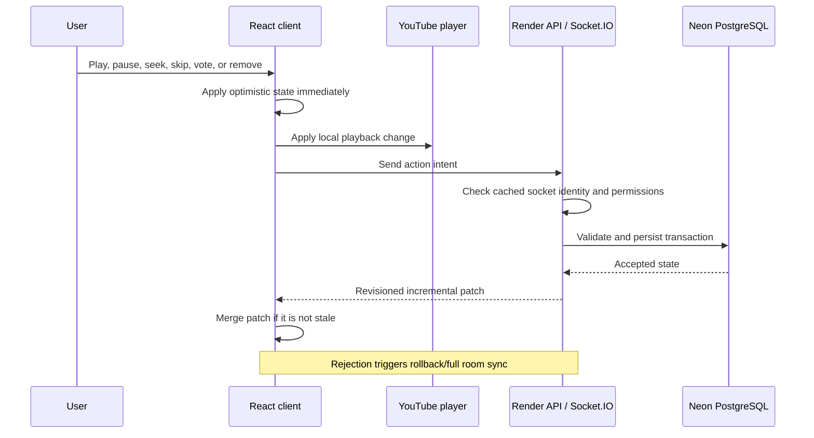

# Connectify Performance and Reliability Architecture

This note records the latency and playback problems found during Connectify's prototype phase, their root causes, and the architecture used to solve them. It describes the implementation as it exists in the repository, including its remaining limitations.

## Design goals

Connectify has two different performance targets:

1. **Perceived latency:** the interface should react within roughly 100 ms, even when the network or database is slower.
2. **Authoritative convergence:** every participant should eventually receive the same validated room, queue, and playback state.

Those goals require both an optimistic client and an authoritative server. Optimistic state makes the interface feel immediate. The server still validates permissions and party-mode rules, persists the mutation, increments the room revision, and broadcasts the accepted state.



## Friction register

| Observed friction | Root cause | Implemented solution | Remaining limit |
| --- | --- | --- | --- |
| Creating or joining a room took 1–2 minutes after inactivity | Render Free could be asleep, Neon could also need a connection, and startup work began only after the user acted | Frontend calls `/ready` during bootstrap; `/ready` runs `SELECT 1`; Create and Join reuse one readiness promise | A sleeping free Render service can still take about a minute to start |
| Buttons appeared unresponsive for about five seconds | The UI waited for database-backed server confirmation and full-room broadcasts | Play, pause, skip, votes, reactions, removal, reorder, and settings update optimistically; failures request a resync | Remote convergence still depends on network and database latency |
| Joining performed duplicate loading | REST and Socket.IO paths both fetched room state | `room:join` now returns the initial snapshot and vote state in one acknowledgement | Reconnection/full resync still requires a snapshot |
| Every action moved too much data | Full room snapshots were broadcast after small changes | Queue, playback, settings, votes, presence, moments, and chat use focused events and partial revisioned state | Explicit revision-gap detection is not implemented yet |
| Adding a song took 5–10 seconds before anything appeared | Metadata resolution and database validation completed before rendering a queue item | A pending item appears immediately; successful responses replace it and failures remove it | A pasted URL can still wait on external metadata and the backend |
| Adding a search result repeated metadata work | Search metadata was discarded and YouTube was queried again | Search result metadata is sent with the add request and reused when its provider ID matches the URL | Pasted URLs still require resolution when not cached |
| Similar YouTube searches repeatedly consumed quota and time | Equivalent queries and concurrent requests were treated separately | Normalized query keys, a 15-minute bounded memory cache, 24-hour PostgreSQL cache, and in-flight request deduplication | An uncached result page still costs one YouTube search request |
| Seeking lagged behind the progress bar by about two seconds | The React state changed, but the iframe only resynchronized after the server incremented the room revision | Playback position changes now synchronize the iframe immediately; server seek writes are debounced by 120 ms | YouTube may buffer after a large seek |
| Clicking the YouTube iframe paused briefly, then resumed | The iframe paused locally while authoritative room state still said “playing”; the periodic synchronizer corrected it | A focused iframe play/pause transition is propagated as a Connectify intent for authorized users | YouTube policy prevents blocking or covering the embedded player |
| Playback randomly paused or stale tabs interfered | Stale synchronization commands and multiple clients could report state transitions | Revision checks ignore older patches; the server owns expected position; focused user intent is distinguished from hidden/programmatic transitions | Browsers can still suspend media or block autoplay |
| The queue failed to advance when a track ended | Advancement depended too heavily on the foreground client's end event | The server schedules an authoritative end timer; client end reports are validated against current track and expected server time | A duration must be known before the server can schedule an exact end |
| A backgrounded tab did not start a newly loaded song | Mobile/browser autoplay policies and tab suspension can block programmatic playback | One persistent iframe, focus/visibility/online recovery, expected-position resync, and Picture-in-Picture where supported | Web code cannot override operating-system background or autoplay policy |
| Changing tracks caused extra startup work | The YouTube iframe was destroyed and recreated | One iframe persists and receives `loadVideoById` or `cueVideoById` for the next track | YouTube still controls media fetching and buffering |
| Removing the active track left the old video visible | The persistent iframe received `track = null` but retained the previous media | Empty state stops, clears, and hides the iframe without destroying it | None known |
| Direct room links showed “Page Not Found” in the tab | Vercel `cleanUrls` conflicted with a rewrite destination ending in `/app.html`; React then hydrated over the 404 shell | Private app routes rewrite to `/app`, and the room sets its own document title | Vercel must finish deploying the corrected routing configuration |

## 1. Startup and cold-start hiding

`client/src/main.tsx` starts `warmBackend()` as soon as JavaScript executes on the landing page or a direct room URL. This begins while the visitor is reading or entering room details.

`client/src/api.ts` owns one module-level readiness promise:

- simultaneous callers share the same request;
- a successful result is remembered in `sessionStorage` for 60 seconds;
- the request uses `cache: "no-store"`;
- a 75-second abort protects against an indefinitely stalled cold start;
- a failed readiness request does not permanently poison later retries.

`GET /ready` performs a minimal Neon `SELECT 1` and returns both database and total timing. Create and Join wait for the shared promise, so they do not send duplicate wake-up traffic.

This is **pre-warming**, not a keep-alive system. Connectify does not send recurring traffic to bypass Render's free-tier sleep policy.

## 2. Room joining and permission caching

The Socket.IO `room:join` acknowledgement returns:

- the initial room snapshot;
- the participant's role;
- any newly issued host token;
- the participant's existing track votes.

The server stores the joined room, participant ID, host status, and guest permissions in `socket.data`. Common controls therefore call `canControl(socket)` without re-querying membership for every button press. Database validation still protects track existence, room ownership, mode rules, and mutations.

The client reconnects with a 250 ms initial delay and a 2-second maximum delay. A reconnect performs a fresh join so the server can rebuild trusted socket state.

## 3. Optimistic interaction fast path

The client changes local state before waiting for the acknowledgement:

- play and pause update playback state and the iframe;
- skip predicts the next track;
- seek updates position immediately;
- a vote marks the participant as voted;
- reactions render a temporary local burst;
- queue removal and reorder update the list;
- room settings update the visible controls.

The server response is still authoritative. If a command is rejected because permissions, queue state, or party mode changed, the client calls `room:sync` and shows an error.

### Why revisions matter

Every persisted room mutation increments `room.revision`. Incremental patches include that revision. The client refuses a patch older than its current revision, preventing a slow response from overwriting newer state.

Current limitation: the client does not explicitly detect a jump such as revision 10 to revision 13. Full snapshots occur on initial join, reconnect, explicit `room:sync`, and rejected optimistic actions. Adding formal sequence-gap recovery is a future hardening step.

## 4. Queue and media-resolution path

When Add is pressed, `RoomPage` inserts a `pending-*` track immediately. It contains the search result's title, artist, thumbnail, provider ID, and duration when available. For a pasted URL it displays a resolving state.

The server:

1. parses and validates the request;
2. resolves the room and media metadata concurrently;
3. verifies that supplied metadata belongs to the provider ID in the URL;
4. runs independent membership, limit, duplicate, artist, and position queries in parallel;
5. creates the track and increments the room revision transactionally;
6. returns the created track before asynchronously broadcasting the new queue state.

Pasted URL metadata uses a bounded 24-hour in-memory cache. YouTube oEmbed has a strict two-second timeout and a canonical-title/thumbnail fallback, so a metadata outage does not make the queue unusable.

## 5. Playback clock and synchronization

The database stores:

- `currentTrackId`;
- `isPlaying`;
- `playbackPosition`;
- `startedAt`;
- `serverTime` in serialized state.

Clients calculate effective position from the stored position plus elapsed server time and elapsed time since receipt. This avoids treating any participant's wall clock as the sole source of truth.

The persistent YouTube player:

- loads a new video only when the provider ID changes;
- compares iframe time with expected room time;
- avoids aggressive seeks while YouTube reports buffering;
- corrects normal drift above roughly 1.25 seconds;
- uses a tighter roughly 0.45-second threshold during forced recovery;
- runs periodic health checks every four seconds;
- recovers after visibility, focus, reconnection, and network restoration.

Large seeks can still buffer because media segments come from YouTube's network. Connectify can issue `seekTo` immediately but cannot guarantee that the requested segment is already downloaded.

## 6. Track ending and queue advancement

There are two end signals:

1. the YouTube iframe can report `ENDED`;
2. the server schedules a timer from duration and authoritative expected position.

Client reports are accepted only if they refer to the current track and are near its expected end. The server timer uses the same current track and then advances the room itself. This prevents a stale or malicious tab from skipping a newer track and allows advancement even when participants are backgrounded.

Only a verified advancement mutates the queue. The subsequent revisioned queue patch makes every client converge on the same next track.

## 7. Direct iframe interaction

Connectify cannot legally or safely place an invisible click-blocking layer over the YouTube player. YouTube's embedded-player requirements prohibit obscuring or disabling standard player functionality.

Instead, `YouTubePlayer` checks whether a `PLAYING` or `PAUSED` transition came from the currently focused iframe:

- authorized user intent is sent through the normal `playback:set` path;
- hidden-tab and programmatic transitions are not treated as user intent;
- unauthorized toggles are corrected immediately from room state.

This makes direct YouTube clicks and Connectify's custom controls converge on the same authoritative state.

## 8. Instrumentation

### Browser

`recordClientTiming()` creates User Timing entries and dispatches a `connectify:timing` browser event. Important names include:

- `backend:ready`;
- `api:POST:/api/rooms`;
- `api:POST:/api/rooms/:code/tracks`;
- `socket:room:join`;
- `socket:playback:set`;
- `socket:playback:seek`;
- `socket:playback:advance`.

To inspect timings during development:

```js
window.addEventListener("connectify:timing", event => console.log(event.detail));
```

The Network panel also exposes `Server-Timing` values from REST responses.

### Server

- `/ready` returns `databaseMs` and `totalMs`.
- REST responses include an `app` duration in `Server-Timing`.
- timed Socket.IO handlers emit JSON logs with `type: "socket_timing"`, event name, and duration.

When diagnosing a delay, separate it into:

```text
browser feedback → transport → server handler → database → broadcast → player transition
```

This prevents a YouTube buffering delay from being mistaken for a database delay, or a Render cold start from being mistaken for a slow room query.

## 9. Production verification runbook

Test with at least two desktop browsers and two phones:

1. Open the landing page after Render has slept and confirm the wake-up begins before Create/Join.
2. Record `/ready` total time and its `databaseMs` portion.
3. Join the same room on all devices and confirm only one initial snapshot is required per client.
4. Exercise every control and verify immediate local feedback plus eventual remote convergence.
5. Drag the seek bar and confirm immediate local seeking without flooding requests.
6. Click directly on the focused YouTube player and confirm the room play/pause state changes.
7. Add both a search result and a pasted URL; confirm pending rows and replacement/error behavior.
8. Background different participants across a track ending and confirm exactly one advancement.
9. Disconnect and restore a network, then verify revision-safe recovery.
10. Remove the active track and confirm the iframe becomes empty.
11. Repeat under network throttling and with one browser intentionally several seconds behind.

## 10. Known limits and next steps

- Render Free cold starts cannot be eliminated without an always-on service.
- Browser and mobile operating-system media policies cannot be bypassed.
- YouTube controls media availability, embeddability, buffering, ads, and regional restrictions.
- One Render instance owns in-memory presence and timers. Horizontal scaling requires a Socket.IO adapter and distributed scheduling.
- Formal revision-gap detection would make incremental event recovery stronger.
- Durable aggregated latency dashboards are not implemented; current metrics are browser events, response headers, and structured logs.

## Source map

| Concern | Primary implementation |
| --- | --- |
| Readiness and browser timing | `client/src/api.ts`, `client/src/main.tsx` |
| Optimistic UI and room sockets | `client/src/RoomPage.tsx` |
| Playback clock math | `client/src/playback.ts` |
| Persistent iframe and recovery | `client/src/YouTubePlayer.tsx` |
| REST, Socket.IO, timings, and end scheduling | `server/src/index.ts` |
| Fair queue and state serializers | `server/src/room-service.ts` |
| YouTube URL and metadata resolution | `server/src/youtube.ts` |
| Search caching and request deduplication | `server/src/search-service.ts` |
| Permission and ending rules | `server/src/room-policy.ts` |

